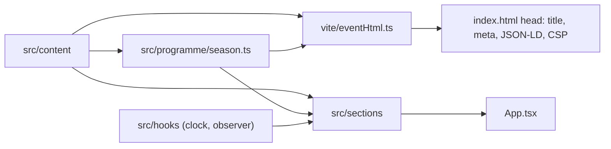

# Architecture

A static, client-rendered one-page site. There is no backend, API, or user input; all content ships in the bundle. Setup and scripts are in [README.md](README.md); visual rules are in [DESIGN.md](DESIGN.md).

## Module map

```
index.html             HTML shell; %TOKENS% filled from src/content at build time
vite.config.ts         Vite + Vitest config
vite/eventHtml.ts      Build plugin: fills head tokens, injects JSON-LD and CSP
src/
  main.tsx             Entry: fonts, global styles, mounts <App>
  App.tsx              Page composition and deep-link scrolling
  content/             Event facts and copy (pure data, no React)
    event.ts           Name, season, organiser, venue, contacts
    programme.ts       Nights: date, times, title, episode, tag
    highlights.ts      Highlight list
    gallery.ts         Photos with alt text and dimensions
    sections.ts        Section IDs (public URL fragments) and navigation
  programme/season.ts  Pure time logic: season phase, night state, formatting
  hooks/               React hooks for browser side effects
    useNow.ts          Clock that re-renders on an interval
    useActiveSection.ts  IntersectionObserver for the current nav item
  components/          Reusable UI primitives (Icon, SectionHeading)
  sections/            One component + stylesheet per page section
  styles/              tokens.css (design tokens), base.css (reset, shared primitives)
public/                Static assets served as-is
```

## Data flow



## Dependency rules

```
sections   ->  components, hooks, programme, content
components ->  (nothing in src)
hooks      ->  (nothing in src)
programme  ->  content
vite/      ->  programme, content
content    ->  (nothing)
```

- `content/` and `programme/` must not import React, sections, components, or hooks, so the build plugin and tests can use them in Node. Enforced by `no-restricted-imports` in `eslint.config.js`.
- Sections do not import each other.
- Colours, type sizes, spacing, and radii come from `tokens.css`; components do not hard-code new ones.

## Where new code goes

- New event fact or copy: `src/content/`.
- New date or time rule: `src/programme/season.ts`, with a test in `season.test.ts`.
- New page section: `src/sections/<Name>.tsx` and `<Name>.css`, an ID in `content/sections.ts`, and an entry in `App.tsx`.
- A UI pattern used by two or more sections: `src/components/`.
- A new browser side effect (timer, observer, media query): `src/hooks/`.
- A new head tag or structured-data field: `vite/eventHtml.ts`, with a test in `eventHtml.test.ts`.

## Production readiness

- Checks: `npm run check` runs format check, lint, tests, and build; CI runs it plus `npm audit` and a gitleaks history scan.
- Reproducibility: Node.js pinned in `.nvmrc`, committed `package-lock.json`, installs via `npm ci`, LF endings enforced by `.gitattributes`.
- Config: none at runtime. Every value is a build-time constant in `src/content/`, so there is no `.env`.
- Scaling: the output is static files, so traffic scales with the host or CDN. The only timers are `useNow` (1 s in the hero, 30 s in the programme) and they are cleared on unmount.

## Decisions

- **Single source for event facts.** Dates, the season year, and "years running" previously disagreed between the HTML head, the hero, About, and Highlights. Everything is now derived from `content/`.
- **Time zone.** Nights are stored as IST wall-clock times with an explicit offset, so the season status is correct for visitors in any time zone.
- **Build-time head.** Crawlers read the HTML head without running JavaScript, so title, meta, and JSON-LD are rendered at build time by `vite/eventHtml.ts`.
- **CSP as a meta tag.** The hosting setup cannot be assumed to support headers. The tag is added in production builds only, because the dev server needs inline scripts. `frame-ancestors` cannot be set this way; see README.
- **Self-hosted fonts.** This avoids a render-blocking third-party stylesheet and lets the CSP stay `'self'`.
- **Plain CSS per component** instead of the former utility-class sheet. The site is small, and co-located styles keep each section self-contained.
- **No router or state library.** One page with anchor navigation; section IDs in `content/sections.ts` are public URLs and must stay stable.
- **Plain `npm run dev`.** There is one process (Vite) and no Python or services, so a custom launcher script would add code without benefit.
- **Asset paths.** Images live in `public/Images/` (capital I). Paths must match that case because production hosts are case-sensitive.

## Allowed duplication

`npx jscpd src vite --min-tokens 30` reports 2 exact clones (13 lines, 0.51%). Both are kept:

- Import blocks shared by several sections (for example, `Hero.tsx` and `Programme.tsx` import the same `season.ts` helpers).
- Literal expected values in tests.

## Growth signals

- More than one page or route: add a router and move `sections/` under `pages/<route>/`.
- Content edited by non-developers: move `src/content/` to a headless CMS or JSON files loaded at build time.
- Several seasons shown at once: key `programme` by season and add an archive section.
- A third shared UI pattern or a form: add the primitive to `components/` and the matching rules to DESIGN.md before using it in a section.
- Any server-side need (donations tracking, sign-ups): add it as a separate package with its own boundary; do not put network calls in `content/` or `programme/`.
